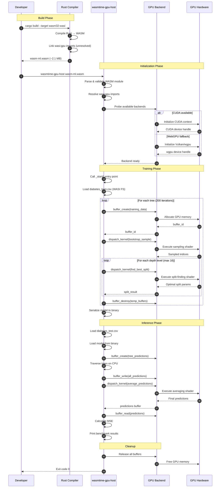
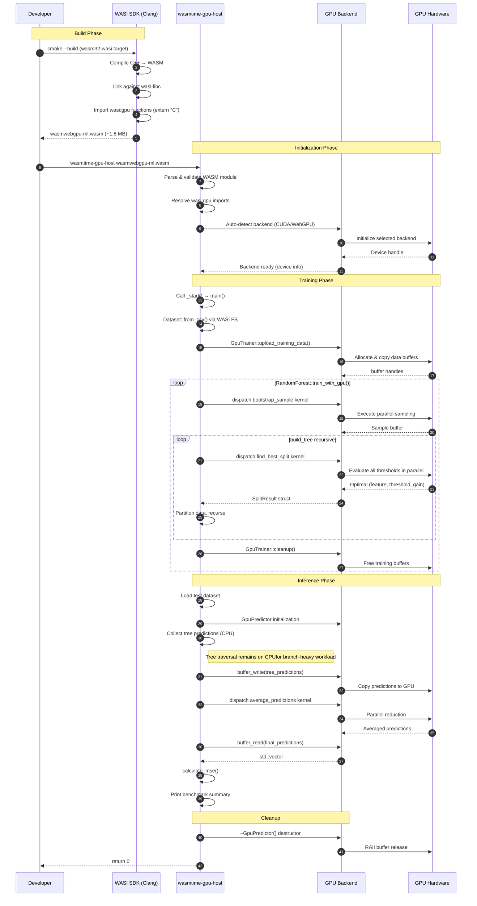

# confidential-ai-healthcare-demo

```mermaid
sequenceDiagram
    autonumber
    participant Dev as Developer
    participant RC as Rust Compiler
    participant RT as wasmtime-gpu-host
    participant GPU as GPU Backend
    participant HW as GPU Hardware

        Note over Dev,RC: Build Phase
        Dev->>RC: cargo build --target wasm32-wasi
        RC->>RC: Compile Rust → WASM
        RC->>RC: Link wasi:gpu imports (unresolved)
        RC-->>Dev: wasm-ml.wasm (~2.1 MB)

        Note over RT,HW: Initialization Phase
        Dev->>RT: wasmtime-gpu-host wasm-ml.wasm
        RT->>RT: Parse & validate WASM module
        RT->>RT: Resolve wasi:gpu imports
        RT->>GPU: Probe available backends
        alt CUDA available
            GPU->>HW: Initialize CUDA context
            HW-->>GPU: CUDA device handle
        else WebGPU fallback
            GPU->>HW: Initialize Vulkan/wgpu
            HW-->>GPU: wgpu device handle
        end
        GPU-->>RT: Backend ready

        Note over RT,HW: Training Phase
        RT->>RT: Call _start() entry point
        RT->>RT: Load diabetes_train.csv (WASI FS)
        
        loop For each tree (200 iterations)
            RT->>GPU: buffer_create(training_data)
            GPU->>HW: Allocate GPU memory
            HW-->>GPU: buffer_id
            GPU-->>RT: buffer_id
            
            RT->>GPU: dispatch_kernel(bootstrap_sample)
            GPU->>HW: Execute sampling shader
            HW-->>GPU: Sampled indices
            
            loop For each depth level (max 16)
                RT->>GPU: dispatch_kernel(find_best_split)
                GPU->>HW: Execute split-finding shader
                HW-->>GPU: Optimal split params
                GPU-->>RT: split_result
            end
            
            RT->>GPU: buffer_destroy(temp_buffers)
        end
        RT->>RT: Serialize model to binary

        Note over RT,HW: Inference Phase
        RT->>RT: Load diabetes_test.csv
        RT->>RT: Load model from binary
        
        RT->>GPU: buffer_create(tree_predictions)
        RT->>RT: Traverse trees on CPU
        RT->>GPU: buffer_write(all_predictions)
        RT->>GPU: dispatch_kernel(average_predictions)
        GPU->>HW: Execute averaging shader
        HW-->>GPU: Final predictions
        GPU-->>RT: predictions buffer
        RT->>GPU: buffer_read(predictions)
        
        RT->>RT: Calculate MSE
        RT->>RT: Print benchmark results

        Note over RT,GPU: Cleanup
        RT->>GPU: Release all buffers
        GPU->>HW: Free GPU memory
        RT-->>Dev: Exit code 0
```

-----------

```mermaid
sequenceDiagram
    autonumber
    participant Dev as Developer
    participant CC as WASI SDK (Clang)
    participant RT as wasmtime-gpu-host
    participant GPU as GPU Backend
    participant HW as GPU Hardware

        Note over Dev,CC: Build Phase
        Dev->>CC: cmake --build (wasm32-wasi target)
        CC->>CC: Compile C++ → WASM
        CC->>CC: Link against wasi-libc
        CC->>CC: Import wasi:gpu functions (extern "C")
        CC-->>Dev: wasmwebgpu-ml.wasm (~1.8 MB)

        Note over RT,HW: Initialization Phase
        Dev->>RT: wasmtime-gpu-host wasmwebgpu-ml.wasm
        RT->>RT: Parse & validate WASM module
        RT->>RT: Resolve wasi:gpu imports
        RT->>GPU: Auto-detect backend (CUDA/WebGPU)
        GPU->>HW: Initialize selected backend
        HW-->>GPU: Device handle
        GPU-->>RT: Backend ready (device info)

        Note over RT,HW: Training Phase
        RT->>RT: Call _start() → main()
        RT->>RT: Dataset::from_csv() via WASI FS
        
        RT->>GPU: GpuTrainer::upload_training_data()
        GPU->>HW: Allocate & copy data buffers
        HW-->>GPU: buffer handles
        
        loop RandomForest::train_with_gpu()
            RT->>GPU: dispatch bootstrap_sample kernel
            GPU->>HW: Execute parallel sampling
            HW-->>GPU: Sample buffer
            
            loop build_tree recursive
                RT->>GPU: dispatch find_best_split kernel
                GPU->>HW: Evaluate all thresholds in parallel
                HW-->>GPU: Optimal (feature, threshold, gain)
                GPU-->>RT: SplitResult struct
                RT->>RT: Partition data, recurse
            end
        
        RT->>GPU: GpuTrainer::cleanup()
        GPU->>HW: Free training buffers
    end

        Note over RT,HW: Inference Phase
        RT->>RT: Load test dataset
        
        RT->>GPU: GpuPredictor initialization
        
        RT->>RT: Collect tree predictions (CPU)
        Note right of RT: Tree traversal remains on CPUfor branch-heavy workload
        
        RT->>GPU: buffer_write(tree_predictions)
        GPU->>HW: Copy predictions to GPU
        
        RT->>GPU: dispatch average_predictions kernel
        GPU->>HW: Parallel reduction
        HW-->>GPU: Averaged predictions
        
        RT->>GPU: buffer_read(final_predictions)
        GPU-->>RT: std::vector
        
        RT->>RT: calculate_mse()
        RT->>RT: Print benchmark summary

        Note over RT,GPU: Cleanup
        RT->>GPU: ~GpuPredictor() destructor
        GPU->>HW: RAII buffer release
        RT-->>Dev: return 0
```